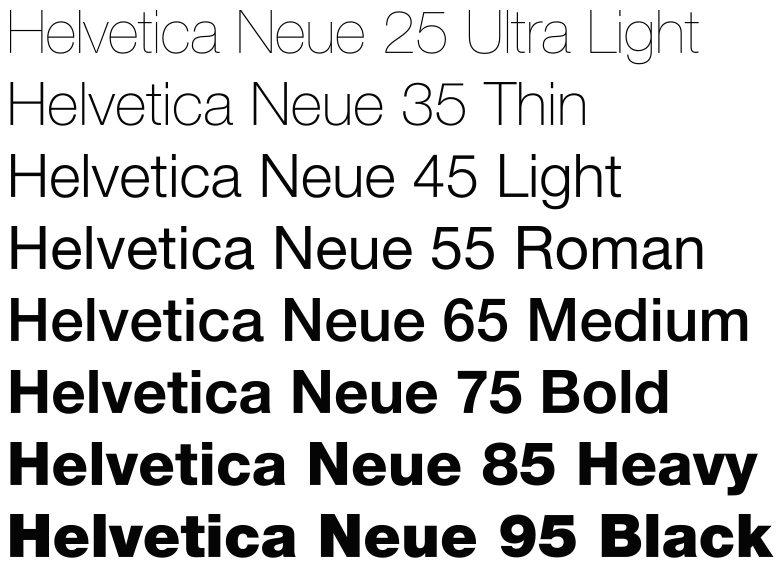
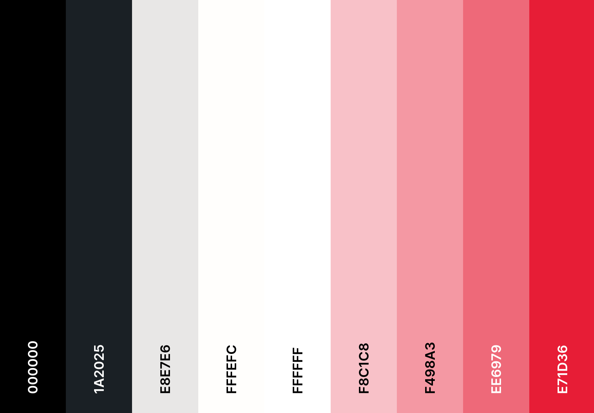
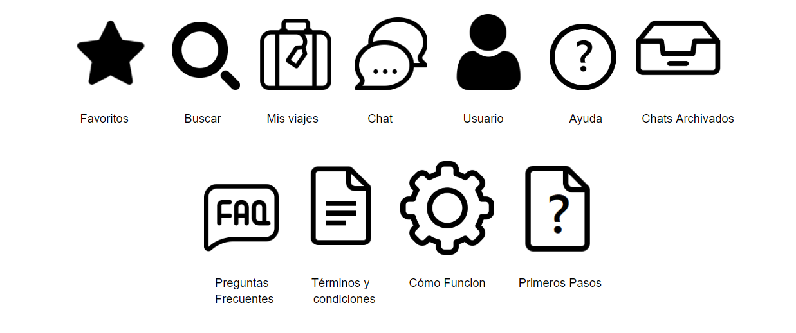

# PRÁCTICA 3 - Tu equipo UX Case Study
## Análisis de MuseMap

Tras analizar y examinar el caso de estudio propuesto, nuestra valoración general es que el análisis de la UX de la app MuseMap Street App ha sido una experiencia similar a la nuestra estudiando la app para encontrar compañeros de viajes con intención romántica, Miss Travel.

En primer lugar, con MuseMap comienzan describiendo la app y exponiendo los objetivos del cliente. En nuestro caso, no nos pusimos en el supuesto de que la app fuese un encargo comercial, por lo que, no analizamos tan detenidamente el trasfondo de la app. 

Otra práctica que realizan con motivos comerciales, es el análisis competitivo con otras aplicaciones similares, lo que nos ha parecido una técnica muy interesante para analizar las necesidades de los usuarios y plantear otros puntos de vista para resolver el problema.

Por otro lado, este equipo de diseñadores de UX han realizado un trabajo remarcable a la hora de identificar los distintos perfiles de usuarios de la app. Para ello, utilizan técnicas que nos han parecido muy prácticas como son: mapas de empatía, entrevistas a usuarios reales y mapas de afinidad. 

En nuestra experiencia, consideramos que implementar este tipo de técnicas nos hubiese ayudado a crear personas más representativas del tipo de usuario que utiliza Miss Travel. De esta forma, al identificar y conocer mejor la población demográfica de la app, hubiésemos mejorado nuestra definición de objetivos y funcionalidades. 

En cuanto a la creación de personas en MuseMap, hemos echado en falta los canales de comunicación que suelen utilizar las personas, y no vemos muy informativo especificar las marcas favoritas de estos usuarios.

Para terminar con el análisis de la aplicación, podrían haber acompañado sus conclusiones con una malla receptora de información, ya que nosotros la hemos encontrado una solución gráfica y clara para ordenar toda la información recogida en el análisis.

Con respecto a la fase de diseño, hay que destacar que de las dos opciones propuestas para identificar las tareas relevantes para los usuarios, nosotros decidimos realizar matriz de tareas/usuarios. Ahora bien, tras ver un ejemplo de flujo de usuario, consideramos que ambas técnicas cumplen su objetivo y son ciertamente útiles. Asimismo, hemos observado que la matriz de tareas/usuarios ayuda a identificar los distintos tipos de usuarios, mientras que, el flujo de usuario proporciona información adicional para diseñar la arquitectura de la información en la aplicación.

Seguidamente, hemos visto muy apropiado la técnica utilizada para organizar y priorizar las funcionalidades de la app puesto que en proyectos de esta envergadura es importante tener una buena organización que se pueda cumplir de manera realista. 

Por último, creemos que antes de comenzar con los wireframes deberían haber fijado la arquitectura de la información mediante un sitemap y labelling. Para nosotros resultó muy intuitivo y natural organizar la información de la aplicación antes de comenzar a plantear wireframes. Quizás, de esta forma se hubiesen ahorrado alguna repetición del proceso iterativo que han seguido para crear los bocetos de MuseMap. 

No obstante, nos gustaría destacar que nosotros creamos los bocetos Lo-fi en una única acción, y hemos visto útil e interesante el proceso iterativo que han utilizado. Además, lo han complementado con reuniones recurrentes de todos los miembros del equipo, lo que muestra una buena comunicación que busca crear un producto aceptado por todos.

En conclusión, el proceso de análisis y diseño de MuseMap ha sido similar al nuestro con Miss Travel. Sin embargo, hemos encontrado nuevas técnicas que creemos que nos hubiesen favorecido en el desarrollo de nuestro proyecto. Entre ellas destacamos las entrevistas a usuarios reales, la matriz de priorización de funcionalidades y el desarrollo incremental de bocetos lo-fi. Igualmente, consideramos que en el estudio de MuseMap podría haber utilizado la matriz receptora de información, y haber diseñado la arquitectura de la información (sitemap y labelling) antes de comenzar con los diseños de interfaz de usuario.

## Gúia de diseño

### Funcionalidades y Ubicaciones

En cuanto al diseño de funcionalidades y ubicaciones, para crear una UX más favorable y agradable hemos establecido las siguientes directivas:

- En cada página del sitio web, se mostrará:
	- En la parte superior: Una barra de navegación con las principales secciones de la aplicación: buscador de viajes y perfiles, mis viajes, favoritos, ayuda, chats y perfil.
	- En la parte inferior: Una footer con acceso rápido a las redes sociales, el formulario de contacto y la página informativa del equipo de desarrollo de la aplicación.
⋅⋅⋅ Con el objetivo de aumentar la accesibilidad e internacionalización, para cada opción de la barra de navegación se mostrará un icono representativo y el nombre de la sección. 

- Permitir acceder a ciertas secciones de la aplicación sin iniciar sesión. Las secciones públicas serán: búsqueda de viajes, ver información detallada de viajes (sin mostrar el usuario publicador), ayuda y todas las opciones del footer. 

- Implementar un diseño breadcrumbs para que el usuario sepa su ubicación exacta en la web, en cualquier momento.

- Los botones de "Atrás" permitirán retroceder en un solo paso, guardando el lugar exacto en el que se encontraba el usuario previamente y el progreso de los formularios que haya tenido que completar.

- Para procesos que impliquen varios pasos como podría ser publicar viajes, incluir un seguimiento del progreso donde aparezcan todos los pasos para completar la acción, señalizando el paso en el que se encuentra el usuario.

- Priorizar la sencillez en los formularios incluyendo checkboxes o menús desplegables para preguntas con respuestas que se puedan prefijar. Además, en este tipo de campos se incluirá una opción "Otro: " para dar flexibildiad a las respuestas. 

- Mostrar errores de formularios en tiempo real.

- Las barras de búsqueda se localizarán en la parte superior central de las páginas, y las búsquedas contarán con filtros y opciones para reordenar la muestra de resultados.

### Estilo: Tipografía

Por otro lado, centrándonos en el estilo de la página nos hemos decantado por la familia de fuentes sans serif para que sea más fácil de leer. Más concretamente, para títulos utilizaremos helvetica y para el cuerpo Roboto.

### Estilo: Colores

Con respecto a los colores, nos hemos detantado por utilizar un estio minimalista y monocromático que utiliza el rojo como color principal. 

Con más detalle, se muestra la siguiente tabla donde se asigna los colores concretos de la paleta para ciertos elementos de la aplicación.

| Elemento | Color (HEX)|
|:--------:|:----------:|
| Titulos | #1A2025 |
| Cuerpo de texto | #000000 |
| Fondo de la aplicación |  #FFFEFC |
| Fondo de la barra de navegación | #E71D36 |
| Fondo del footer | #E71D36 |
| Titulo e iconos de la barra de navegación y footer | #FFFFFF |
| Botones | #E71D36 | 
| Texto en botones | #FFFFFF |
| Menus | #FFFEFC |
| Elemento seleccionado | #F498A3 |
| Cajas de texto | #E8E7E6 |
| Checkboxes (fondo) | #FFFEFC |
| Chechboxes (tick) | #E71D36 |
| Bubbles del chat | #F8C1C8 |

### Estilo: Iconos

Finalmente, con respecto a los icónos de la aplicación, aquí se muestran las elecciones finales.

