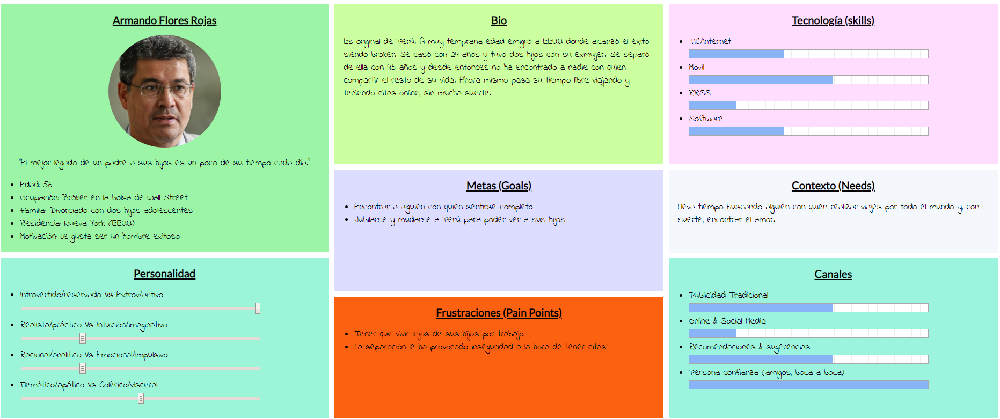
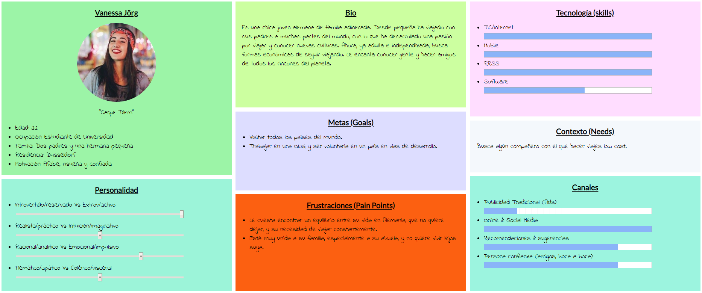
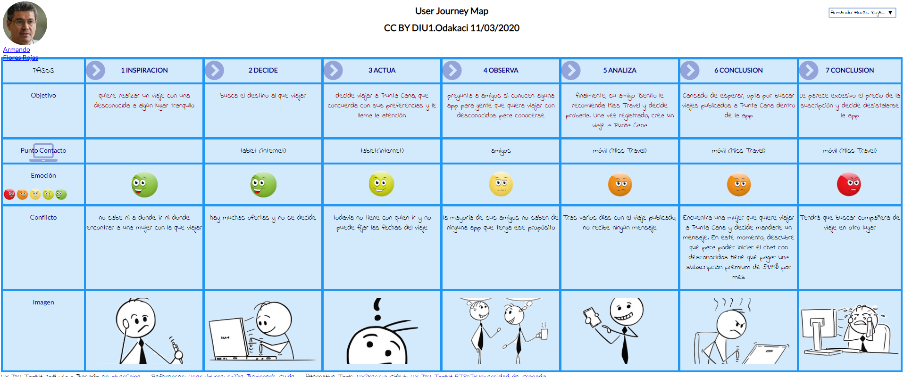
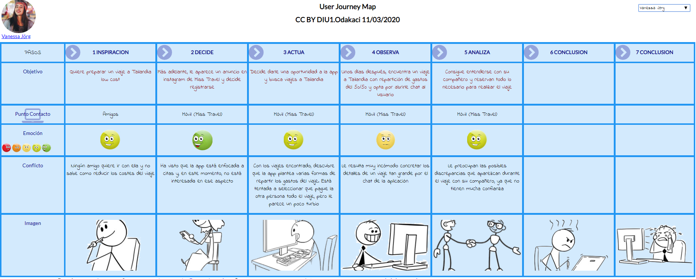
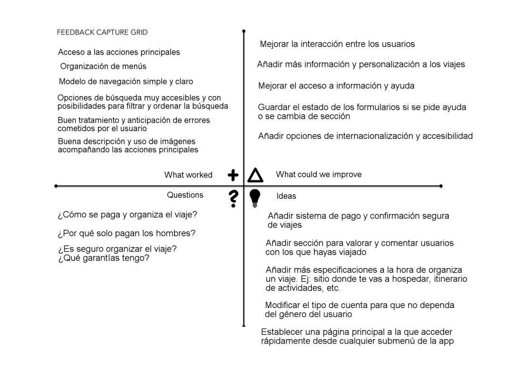
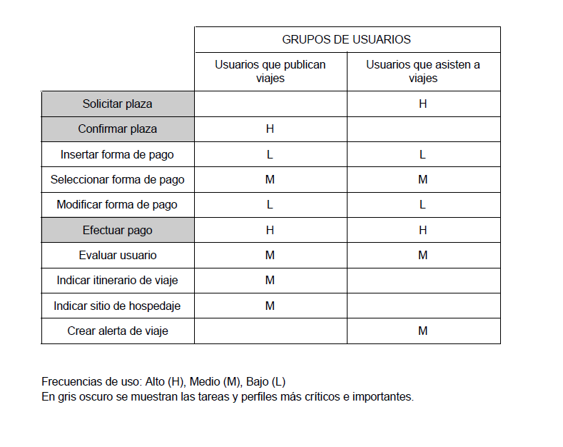
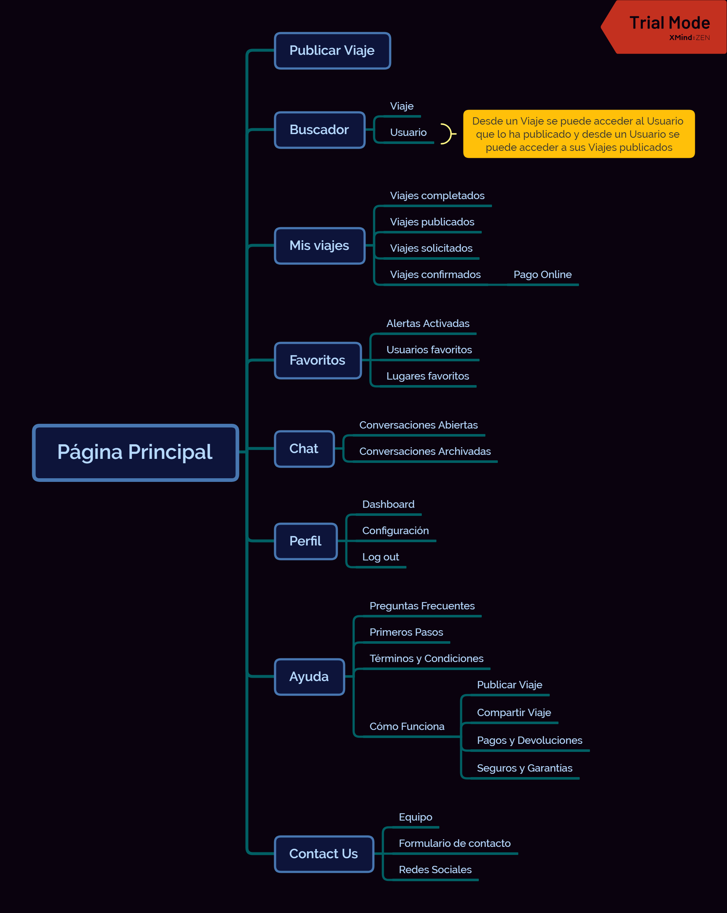

# DIU20
Prácticas Diseño Interfaces de Usuario 2019-20 (Economía Colaborativa) 

Grupo: DIU1_ODAKACI.  Curso: 2019/20 

Proyecto: Miss Travel - UX Case Study

Descripción: 

En este proyecto estudiaremos el caso de Miss Travel, una plataforma de economía colaborativa para encontrar compañeros de viaje con intención romántica.

 Logotipo Equipo:
 

 Logotipo Miss Travel:
 
 

Miembros
 * :bust_in_silhouette:   Mario Rodríguez Chaves     :octocat:     
 * :bust_in_silhouette:  Carmen Martín Moreno     :octocat:

----- 

# Proceso de Diseño 

## Paso 1. UX Desk Research & Analisis 

 1.a Competitive Analysis
-----

>>> Miss Travel es una combinación de app de citas y de viajes en la que puedes publicar viajes que estás dispuesto a realizar con otra persona, a la que le pagas el viaje. La hemos elegido porque nos ha parecido interesante la combinación de estos dos tipos de apps completamente distintas.

 1.b Persona
-----

>>> Hemos seleccionado a Armando y a Vanessa porque son dos de los perfiles más comunes que se encuentran en la app.

 1.c User Journey Map
----

>>> Para tener tanto una experiencia positiva como una negativa al usar la app. Así como, ver los dos puntos de vista de quien paga el viaje y quien no. 

 1.d Usability Review
----
>>> - https://docs.google.com/spreadsheets/d/1E-e0byYJXL5u_i7jzD4xmzKFcew5D4V76reaqwthQpQ/edit?usp=sharing
>>> - Valoración final (numérica): 73 - Good
>>> - Comentario sobre la valoración: Se trata de un sitio web con una base robusta pero con problemas conceptuales.

## Paso 2. UX Design  

 2.a Feedback Capture Grid
----

>>> Comenta con un diagrama los aspectos más destacados a modo de conclusion de la práctica anterior,

  
  
>>> ¿Que planteas como "propuesta de valor" para un nuevo diseño de aplicación para economia colaborativa ?
>>> Problema e hipótesis
>>>  Que planteas como "propuesta de valor" para un nuevo diseño de aplicación para economia colaborativa te
>>> (150-200 caracteres)
>>>
>>> Hemos decidido mantener la filosofía de Miss Travel, app de citas y viajes, pero centrándonos en viajes. Para ello, añadimos valoración de usuarios, sistema de pago y más detalles al publicar viajes.

 2.b Tasks & Sitemap 
-----

>>> Matriz de Usuarios/Tareas

>>> Sitemap de Miss Travel 

 2.c Labelling 
----

>>> Identificar términos para diálogo con usuario  

>>> - https://docs.google.com/document/d/1cUTRaqhEUjHXfGKoGawyUuBvDDr61Y-JF7uDRkSsWXA/edit?usp=sharing

 2.d Wireframes
-----

>>> Bocetos Lo-Fi para las distintas interfaces de usuario
>>> - https://drive.google.com/drive/folders/139u182LvVbhPVnjFe1ZEwJD_2xoEN94h?usp=sharing

## Conclusión / Valoración de las prácticas

>>> (90-150 caracteres) Opinión del proceso de desarrollo de diseño siguiendo metodología UX y valoración (positiva /negativa) de los resultados obtenidos  

