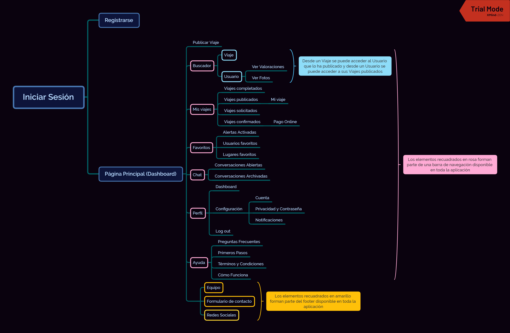

# DIU20
Prácticas Diseño Interfaces de Usuario 2019-20 (Economía Colaborativa) 

Grupo: DIU1_ODAKACI.  Curso: 2019/20 

Proyecto: Miss Travel - UX Case Study

Descripción: 

En este proyecto estudiaremos el caso de Miss Travel, una plataforma de economía colaborativa para encontrar compañeros de viaje con intención romántica.

 Logotipo Equipo:
 

Miembros
 * :bust_in_silhouette:   Mario Rodríguez Chaves     :octocat:     
 * :bust_in_silhouette:  Carmen Martín Moreno     :octocat:

----- 

# Proceso de Diseño 

## Paso 1. UX Desk Research & Analisis 

 1.a Competitive Analysis
-----

>>> Miss Travel es una combinación de app de citas y de viajes en la que puedes publicar viajes que estás dispuesto a realizar con otra persona, a la que le pagas el viaje. La hemos elegido porque nos ha parecido interesante la combinación de estos dos tipos de apps completamente distintas.

 1.b Persona
-----

>>> Hemos seleccionado a Armando y a Vanessa porque son dos de los perfiles más comunes que se encuentran en la app.

 1.c User Journey Map
----

>>> Para tener tanto una experiencia positiva como una negativa al usar la app. Así como, ver los dos puntos de vista de quien paga el viaje y quien no. 

 1.d Usability Review
----
>>> - https://docs.google.com/spreadsheets/d/1E-e0byYJXL5u_i7jzD4xmzKFcew5D4V76reaqwthQpQ/edit?usp=sharing
>>> - Valoración final (numérica): 73 - Good
>>> - Comentario sobre la valoración: Se trata de un sitio web con una base robusta pero con problemas conceptuales.

## Paso 2. UX Design  

 2.a Feedback Capture Grid
----

>>> Comenta con un diagrama los aspectos más destacados a modo de conclusion de la práctica anterior,

  
  
>>> ¿Que planteas como "propuesta de valor" para un nuevo diseño de aplicación para economia colaborativa ?
>>> Problema e hipótesis
>>>  Que planteas como "propuesta de valor" para un nuevo diseño de aplicación para economia colaborativa te
>>> (150-200 caracteres)
>>>
>>> Hemos decidido mantener la filosofía de Miss Travel, app de citas y viajes, pero centrándonos en viajes. Para ello, añadimos valoración de usuarios, sistema de pago y más detalles al publicar viajes. Para más información, se puede visitar el documentos de [PROPUESTA](https://github.com/cmartin-moreno/DIU20/blob/master/P2/PROPUESTA.pdf)

 2.b Tasks & Sitemap 
-----

>>> Matriz de Usuarios/Tareas

>>> Sitemap de Miss Travel 

 2.c Labelling 
----

>>> Identificar términos para diálogo con usuario  

>>> - https://docs.google.com/document/d/1cUTRaqhEUjHXfGKoGawyUuBvDDr61Y-JF7uDRkSsWXA/edit?usp=sharing

 2.d Wireframes
-----

>>> Bocetos Lo-Fi para las distintas interfaces de usuario
>>> - https://drive.google.com/drive/folders/139u182LvVbhPVnjFe1ZEwJD_2xoEN94h?usp=sharing

## Paso 3. Mi equipo UX-Case Study 

 3.a ¿Como se cuenta un UX-Case Study?
-----

>>> Analizar lo aprendido de la experiencia MuseApp 

>>> En líneas generales, la experiencia mostrada en el caso de estudio MuseMap ha sido similar a la nuestra con Miss Travel. Entre los aspectos a destacar, nos ha parecido muy interesante el 
uso de las entrevistas o mapas de empatía para identificar usuarios y sus necesidades, o la matriz de priorización de funcionalidades a la hora de diseñar la aplicación. Por otro lado, consideramos que podrían haber utilizado una matriz receptora de información para organizar y mostrar todos los datos recogidos en el análisis.

>>> El análisis completo del caso de estudio de UX de la aplicación MuseMap Street App se puede encontrar en el archivo [P3/README](https://github.com/cmartin-moreno/DIU20/blob/master/P3/README.md)

  3.b Logotipo
----

>>> Si diseña un logotipo, explique la herramienta utilizada y la resolución empleada. ¿Puede usar esta imagen como cabecera de Twitter, por ejemplo, o necesita otra?

>>> Para el logo de Miss Travel hemos utilizado la herramienta Free Logo Desing (https://es.freelogodesign.org/). El diseño creado sigue el estilo minimalista que perseguimos durante toda la aplicación. Para ello, hemos establecido una imagen principal, una maleta, y hemos añadido el nombre de la app. La resolución utilizada ha sido 200x200px, ya que la resolución del banner superior de la página web hemos establecido que tendrá 400px de ancho.

>>> Para visualizarlo correctamente, lo presentamos en color negro, pero en el banner aparecerá en blanco como el resto de los iconos. 

>>>Logotipo Miss Travel:

 3.c Guidelines
----

>>> Tras documentarse, muestre las deciones tomadas sobre Patrones IU a usar para la fase siguiente de prototipado. 

>>> Miss Travel es una aplicación web diseñada para ser funcional y accesible. Algunas de las decisiones tomadas para conseguir estos objetivos han sido: seguir un diseño de bradcrumb para simplificar la navegación o presenta los botones con iconografía y texto para fomentar la internacionalización y la accesibilidad.

>>> Por otro lado, el estilo se caracteríza por un diseño minimalista y elegante, donde se sigue una linea de color monocromática en tonos rojos y rosados. 

>>> Para más información, se puede ver la guía de diseño completa en el archivo [P3/README](https://github.com/cmartin-moreno/DIU20/blob/master/P3/README.md)

 3.d Video
----

>>> Documente y resuma el diseño de su producto en forma de video de 90 segundos aprox

>>> El vídeo se encuentra en el siguiente enlace de Google Drive https://drive.google.com/drive/folders/1W0cWyLpy1G-36iHVi_489dehFkwCnHvJ?usp=sharing

3.e Conclusión final / Valoración de las prácticas
---- 

>>> (90-150 palabras) Opinión del proceso de desarrollo de diseño siguiendo metodología UX y valoración (positiva /negativa) de los resultados obtenidos  

>>> Nuestra valoración final del proceso de desarrollo ha sido gratamente positiva. Por primera vez, nos hemos puesto en una situación más profesional donde se ha tenido en cuenta al usuario a la hora de diseñar la aplicación. 

>>> Utilizando técnica como son las Personas Ficticias o los Journey Maps hemos descubiertos formas muy eficientes y útiles para recoger información de usuarios De esta forma, creemos que hemos diseñado un producto accesible, intuitivo y funcional.

>>> En cuanto a la experiencia diseño, cabe resaltar que no teniamos experiencia previa diseñando software. Por lo que, técnicas para organizar la arquitectura de la información como el sitemap y el labelling nos han parecido muy útiles a la hora de crear un buen diseño centrado en la UX. 

>> >En resumen, una experiencia muy productiva y útil para tener buenas técnicas de desarrollo de software para el futuro.

## Paso 4. Evaluación 

 4.a Casos asignados
----

>>> Descripción de las asignaciones (3 UX Case Study) y enlace a  sus repositorios.

>>> El UX Case Study desarrollado por el equipo DUI1.PAPAYA analiza y desarrolla Travel Grain, una red social de viajeros donde se pondrán compartir fotos y experiencias sobre los viajes realizados.

>>> [Repositorio DIU1.PAPAYA](https://github.com/RubenDelgadoPareja/DIU20)  
>>> [Valoración DIU1.PAPAYA](https://github.com/cmartin-moreno/DIU20/blob/master/P4/README.md)

>>> [DIU2.Plata](https://github.com/Superkorlas/DIU_Practicas)  
>>> [Valoración DIU2.PLATA](https://github.com/cmartin-moreno/DIU20/blob/master/P4/README.md)

>>> Para este UX Case Study, el equipo DIU3.MAP presenta el proceso de diseño de la aplicación CoNect, una aplicación donde particulares y empresas podrán publicar eventos de ocio.

>>> [DIU3.MAP](https://github.com/MiguelAlberti/DIU20)  
>>> [Valoración DIU3.MAP](https://github.com/cmartin-moreno/DIU20/blob/master/P4/README.md)

 4.b User Testing
----

>>> Para presentar las situaciones conflictivas en las tres aplicaciones valoradas hemos utilizado a Armando.
>>> [Situación DIU1.PAPAYA](https://github.com/cmartin-moreno/DIU20/blob/master/P4/README.md)  
>>> [Situación DIU2.PLATA](https://github.com/cmartin-moreno/DIU20/blob/master/P4/README.md)  
>>> [Situación DIU3.MAP](https://github.com/cmartin-moreno/DIU20/blob/master/P4/README.md)

. 4.c Ranking 
----

>>> Concluya con un ranking de los casos evaluados 

>>> Valoración personal 

